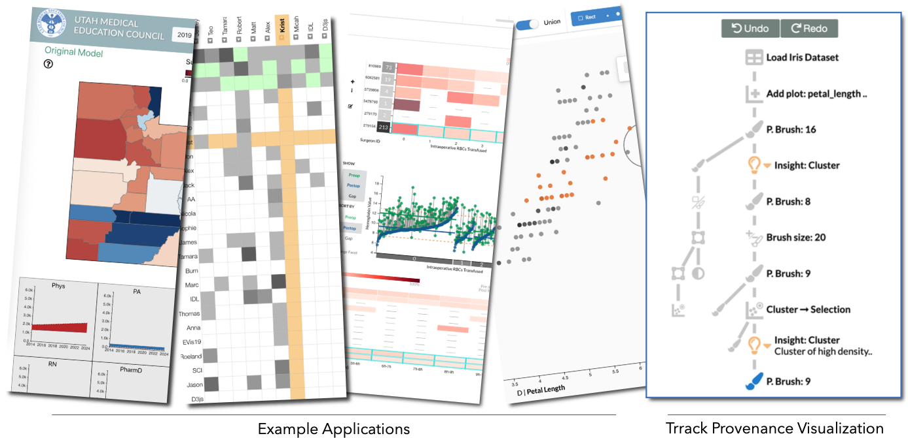

> This version of Trrack has been archived. Please refer to https://github.com/Trrack/trrackjs for the latest updates and releases.
> This archival only affects the github repository. The npm versions of trrack are still available at `@visdesignlab/trrack`.

# The Trrack Provenance Tracking Library

Trrack is a library to create and track provenance (history) in web-based apps. Trrack allows you to create and maintain a non-linear provenance graph representing the history of the state of your visualization. Through this graph, you can easily implement complete action recovery, as well as store custom metadata and annotations.



Trrack also allows for easy sharing of a visualization's current state through URL sharing. To share entire session history, Trrack allows for the import and exporting of provenance graphs, as well as has built in integration with firebase to store the graphs.

For full documentation, see http://vdl.sci.utah.edu/trrack/trrack-docs/index.html

## Features

- Power you application to track user interactions or changes
- Enable undo/redo functionality
- Easy state sharing through a URL
- Track changes in non-linear manner with branches
- Add custom metadata and annotations to each node in the graph
- Built in Firebase support for storing large graphs
- Simple API
- Full Typescript support

Also check out [the paper](https://doi.org/10.31219/osf.io/wnctb) to learn about the design philosophy.

If you're using Trrack in an academic project, please cite:

```
Z. T. Cutler, K. Gadhave and A. Lex, “Trrack: A Library for Provenance Tracking in Web-Based Visualizations”, osf.io preprint. https://doi.org/10.31219/osf.io/wnctb.
```

## Companion Library

Trrack does back-end history management only. If you want to use the history/provenance visualization as well, check out the [trrack-vis library](https://github.com/visdesignlab/trrack/tree/master/packages/trrack-vis), which is designed to provide a customizable front-end for the Trrack library.


## Examples

Here are some examples showing you how to get started:

 * [Basic Usage](https://github.com/visdesignlab/trrack/tree/master/packages/trrack-examples/simpleExample) using provenance with typescript and d3.
 * [More Examples](http://vdl.sci.utah.edu/trrack/) of applications using provenance. Also demonstrates how to import and export the current state of an application, use firebase, and share URLs.

Here are examples of some systems which use Trrack

 * The [Intent System](http://3.136.64.162:5000/index.html#/) ([Code](https://github.com/visdesignlab/intent-system)) is a tool for predicting user intent patterns when brushing in scatterplots. The intent system utilizes the provenance library to control all interaction, as well as the ProvVis library to visualize the resulting provenance graph.
 * [BloodVis](https://github.com/visdesignlab/bloodvis) visualizes blood product usage and outcomes in surgical procedures.
 * The [Workforce Project](https://teamcare.utah.gov/) ([Code](https://github.com/visdesignlab/workforce-frontend)) visualizes a model for predicting workforce needs in the medical sector in Utah.


## Installation

- NPM

```bash
npm install --save-dev @visdesignlab/trrack
npm install --save-dev @visdesignlab/trrack-vis
```

- Yarn

```bash
yarn add @visdesignlab/trrack
yarn add @visdesignlab/trrack-vis

```

- CDN
To use the libraries directly from CDN

```html
<!-- Trrack -->
<script src="//cdn.jsdelivr.net/combine/npm/firebase@7/firebase-app.min.js,npm/firebase@7/firebase-database.min.js,npm/mobx@6/dist/mobx.umd.production.min.js,npm/lz-string@1/libs/lz-string.min.js,npm/deep-diff@1/dist/deep-diff.min.js,npm/@visdesignlab/trrack/dist/trrack.umd.production.min.js"></script>

<!-- Trrack Vis -->
<script src="//cdn.jsdelivr.net/combine/npm/react@17/umd/react.production.min.js,npm/react-dom@17/umd/react-dom.production.min.js,npm/react-move@6/dist/react-move.min.js,npm/typestyle@2/umd/typestyle.min.js,npm/semantic-ui-react@2/dist/umd/semantic-ui-react.min.js,npm/d3@6.2.0/dist/d3.min.js,npm/@visdesignlab/trrack-vis/dist/trrackvis.umd.development.min.js"></script>
```

## Usage

To use Trrack, your application has to be explicit about state: any action that you want to track has to be captured as part of a state that you pass to the Trrack library.


### Sharing a State Through a URL Parameter

Trrack allows instant sharing of state via URL parameter. State sharing is turned on by default. Changing the state of your application will automatically update the URL parameter. Pasting the entire URL into a different web browser will import the state automatically.

### Integrating with Trrack-VIS for provenance visualization

The graph which Trrack creates and utilizes may be visualized using [Trrack-Vis](https://github.com/visdesignlab/trrack/tree/master/packages/trrack-vis). Trrack-Vis has default icons associated with the event type object. TrrackVis exports a React component. To use Trrack-Vis in a javascript environment, you will need to import and use the ProvVisCreator function. See [this simple example](https://github.com/visdesignlab/trrack/blob/dev/packages/trrack-examples/simpleExample/src/provenanceSetup.ts) for how to set up Trrack-Vis with default functionality. For further documentation and a list of customizable parameters that can be passed to Trrack-Vis, see http://vdl.sci.utah.edu/trrack/trrack-vis-docs/interfaces/provvisconfig.html

### Integrating with FireBase and Other Servers

To integrate FireBase with Trrack, you first need to set up a [Firebase](https://firebase.google.com/docs/database) project. Once you've done so, navigate to Settings -> Project settings -> general, and you should find a "firebaseConfig" object on that page. That exact object will be passed into [initProvenance](http://vdl.sci.utah.edu/trrack/trrack-docs/globals.html#initprovenance). Once done, Trrack will automatically store all created nodes to your Firebase project.

To utilize Trrack with other servers, you will use `exportProvenanceGraph` to export the entire graph json and `importProvenanceGraph` to import the same json file.
